# Portafolio de Evidencias
**Asignatura:** Sistemas Programables  
**Docente:** ISC. Gabriel Ubaldo González Cauich  
**Estudiante:** Ricardo Jesus Pech Pool  
**Fecha:** 24/09/2026  
**Parcial / Unidad:** Parcial 1  

---

## 📌 Unidad 1: Sensores
### Competencias
#### Específica(s):
- Aplica principios físicos y comprende
transductores y sensores   
- Analiza y sintetiza la función de los sensores
diversos y sus aplicaciones.
- Aplica sensores de luz, temperatura y su
relación con la variable mensurable
- Organiza y clasifica información proveniente
de fuentes diversas.   
#### Genéricas:
- Habilidades para buscar, procesar y analizar
información procedente de fuentes diversas  
- Capacidad de comunicación oral y escrita  
- Capacidad de trabajo en equipo
- Habilidad para trabajar en forma autónoma.
---
### 📝 Tarea 1: Laboratorio de robótica 1
- **Fecha de entrega:** 07/09/2026
- **Descripción:** En esta práctica realizada en la plataforma GearsBot, se desarrolló un programa en Python para controlar un robot simulado. Se programaron desplazamientos por tiempo para avanzar y retroceder, trayectorias en arco, giros sobre su propio eje en sentido horario o antihorario, además de incluir comentarios en las funciones e imprimir los estados del robot en consola personalizados con mi nombre y emojis.
#### 📸 Evidencias / Capturas
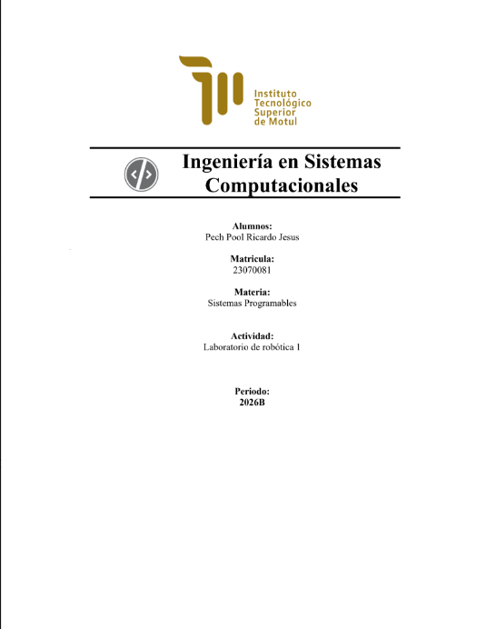
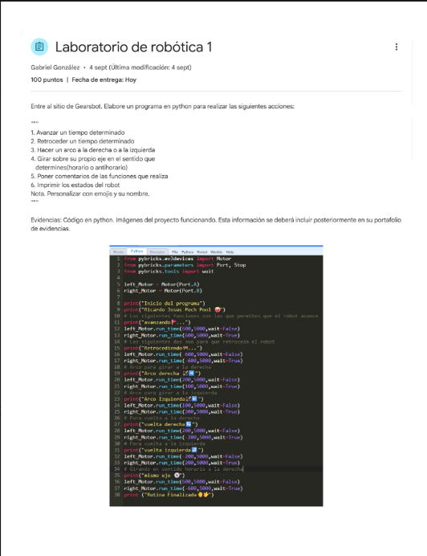
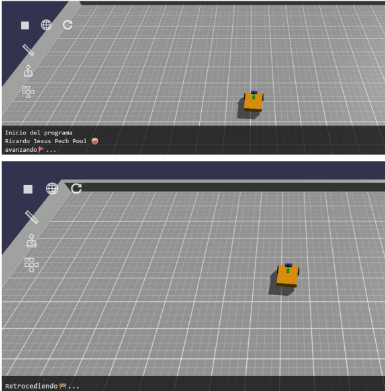
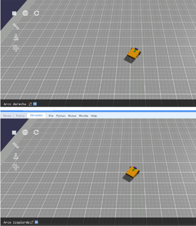
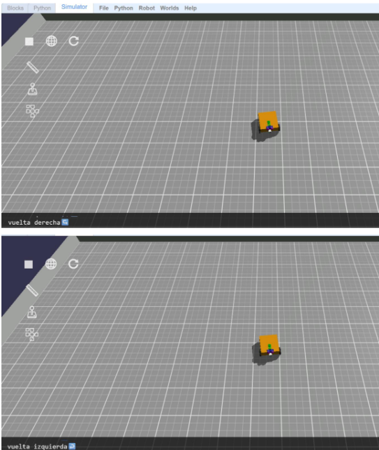
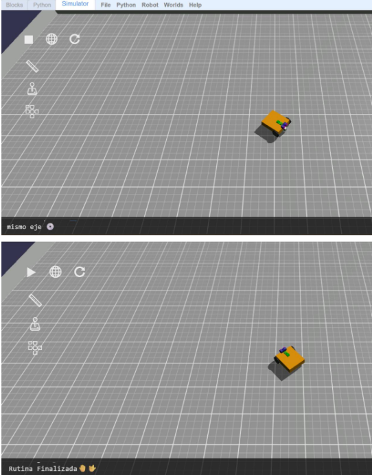

#### Video 📹
https://drive.google.com/file/d/1XGuu6Xme0vdwGMeqlF9ISBNdUpE7xWue/view?usp=sharing

#### 💡 Reflexión sobre aprendizajes obtenidos
> **¿Qué aprendizajes obtuve de la actividad?**  
> *En esta práctica aprendí a utilizar la plataforma GearsBot para simular entornos de robótica programando en Python. Comprendí cómo manipular los motores para hacer giros precisos, trayectorias en arco y control por tiempo, además de la importancia de imprimir los estados en pantalla para saber qué acción está realizando el robot en cada momento.*

#### 🛠️ Análisis de errores y propuesta de mejora
> **¿Qué errores cometí y cómo puedo mejorar aún más la actividad?**  
> *Al inicio tuve problemas para lograr que el giro en arco saliera fluido porque la diferencia de velocidad entre los dos motores era muy alta y el robot terminaba girando sobre su propio eje. Lo solucioné ajustando los valores de potencia hasta conseguir la curva deseada. Para la próxima práctica me gustaría probar el uso de sensores de giro para hacer las vueltas de forma más exacta sin depender únicamente del tiempo.*

---
### 📝 Tarea 2: Laboratorio de robótica 2
- **Fecha de entrega:** 14/09/2026
- **Descripción:** En esta práctica de laboratorio se desarrollaron funciones en Python para controlar el movimiento de un robot (avanzar, retroceder, girar a la derecha, girar a la izquierda y detenerse). Además, se integró el sensor de ultrasonido para medir distancias y esquivar objetos, configurando el mapa con obstáculos mediante un archivo JSON y mostrando en consola los estados del robot en tiempo real.
#### 📸 Evidencias / Capturas
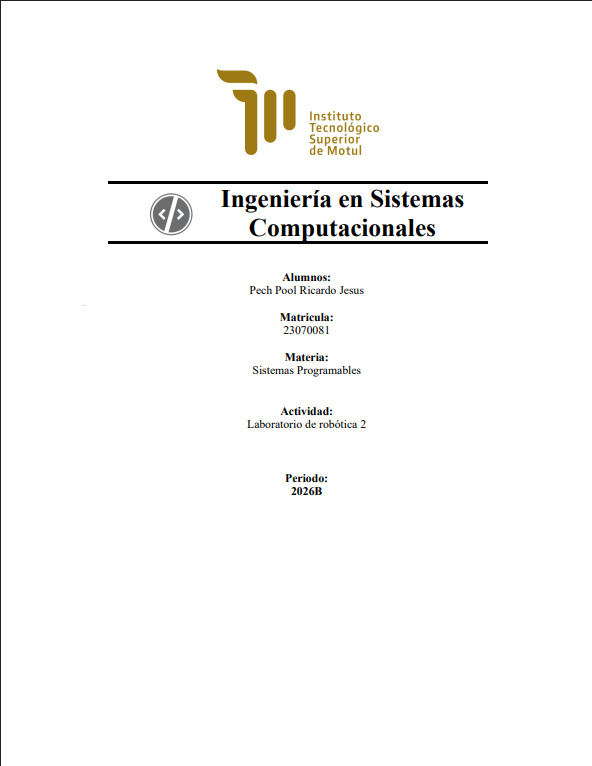
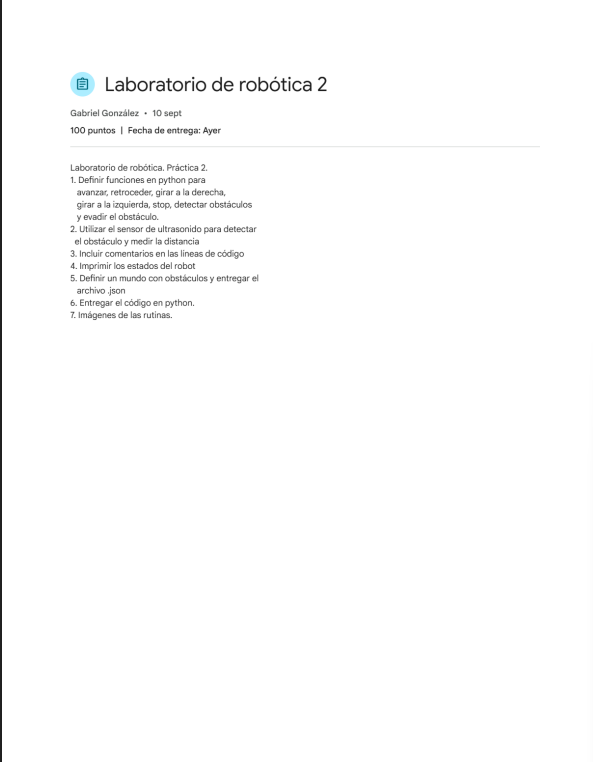
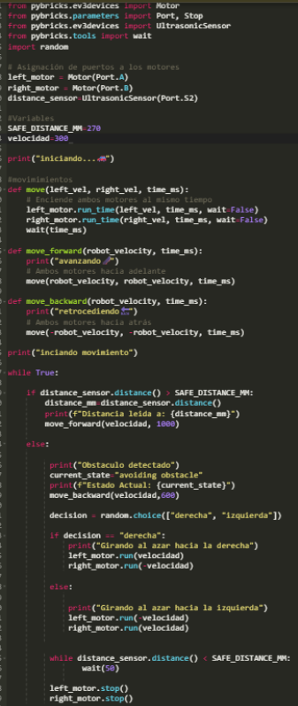
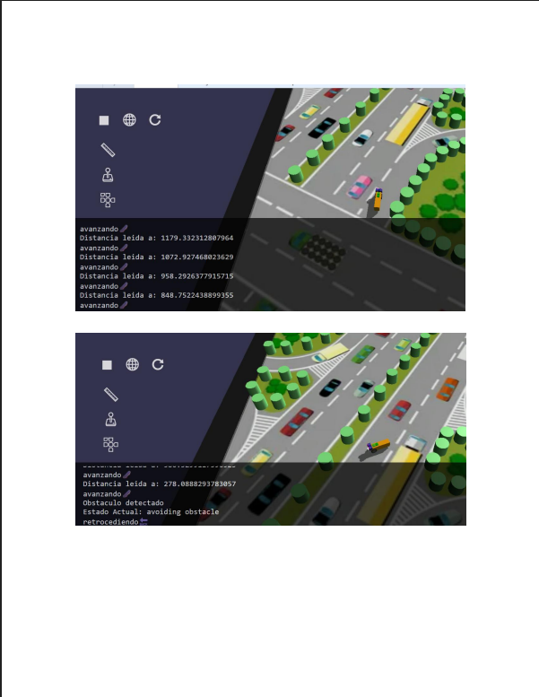
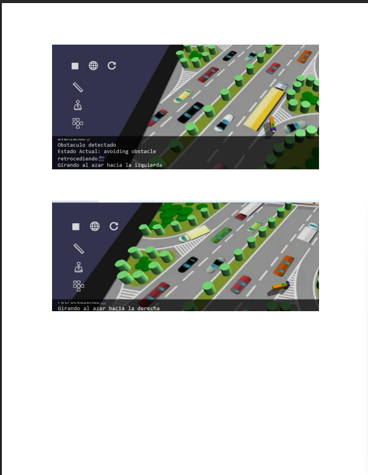
#### Video 📹
https://drive.google.com/file/d/1lRHVad-dcn17Orh667c-G6Zr_ECY9yUL/view?usp=sharing

#### 💡 Reflexión sobre aprendizajes obtenidos
> **¿Qué aprendizajes obtuve de la actividad?**  
> *En esta práctica aprendí a estructurar mi programa mediante funciones independientes para controlar cada movimiento del robot. También entendí cómo funciona la lógica para procesar los datos de un sensor de ultrasonido, lo que me permitió tomar decisiones automatizadas dentro del código para evadir objetos sin la intervención de una persona.*

#### 🛠️ Análisis de errores y propuesta de mejora
> **¿Qué errores cometí y cómo puedo mejorar aún más la actividad?**  
> *Al principio el robot chocaba antes de girar porque la distancia que le asigné al sensor para detenerse era muy corta y no le daba tiempo de hacer la maniobra. Lo solucioné aumentando el margen de distancia en la condición del sensor para que detectara los obstáculos con más anticipación. Para las siguientes prácticas puedo mejorar el programa creando trayectorias de evasión más fluidas en lugar de detenciones repentinas.*

---
### 📝 Practica 1: Práctica de laboratorio 1. Control de actuadores con el ESP32
- **Fecha de entrega:** 14/09/2026
- **Descripción:** En esta práctica de laboratorio se implementó una aplicación embebida utilizando el microcontrolador ESP32 para controlar 3 LEDs (actuadores) mediante la lectura de un botón pulsador. Se programaron las entradas y salidas digitales para manipular la secuencia o el estado de los LEDs según la pulsación recibida.

#### 📸 Evidencias / Capturas
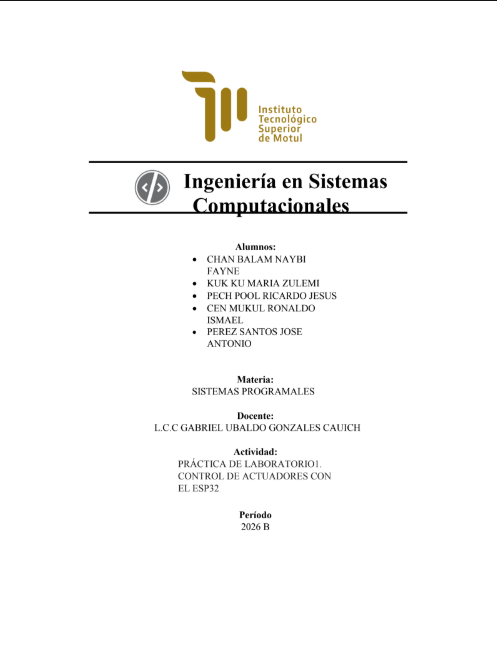
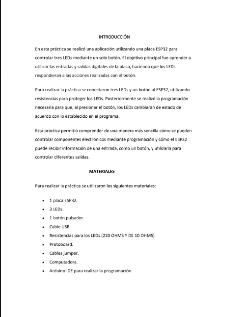
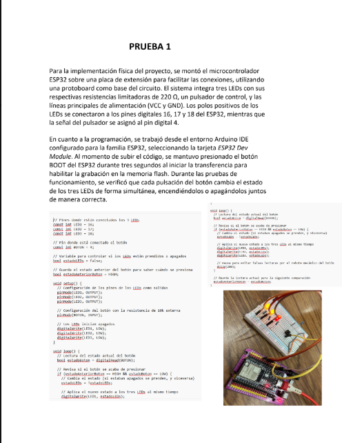
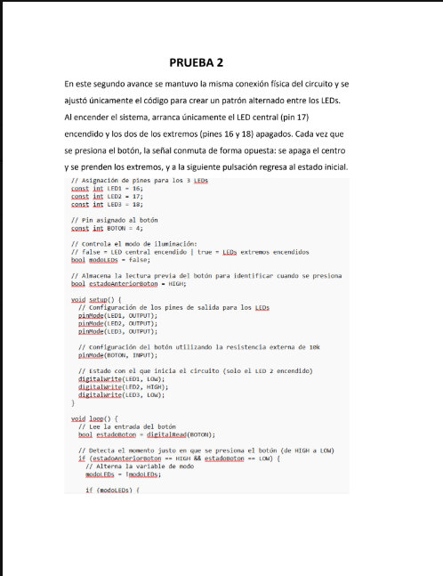
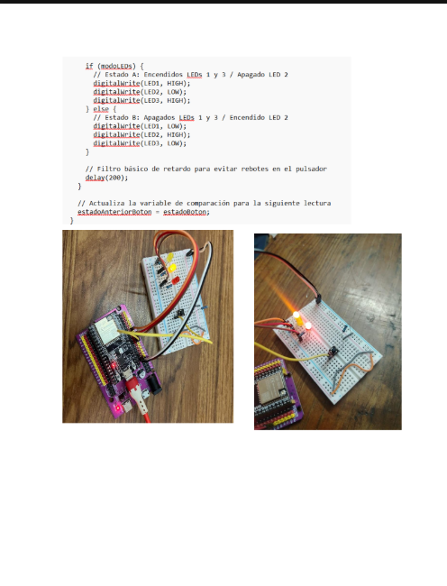
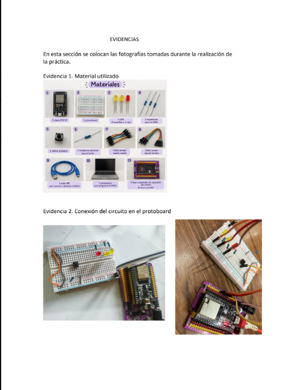
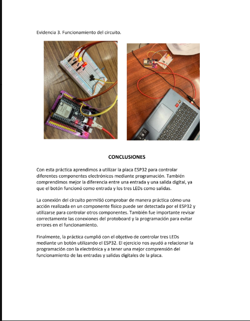
#### 💡 Reflexión sobre aprendizajes obtenidos
> **¿Qué aprendizajes obtuve de la actividad?**  
> *En esta práctica aprendí a configurar los pines de la ESP32 para controlar entradas y salidas digitales. Entendí cómo conectar y programar un botón para que al presionarlo cambie el estado o la secuencia de los tres LEDs, lo cual me ayudó a ver de forma práctica cómo un microcontrolador procesa una orden física y responde encendiendo componentes.*

#### 🛠️ Análisis de errores y propuesta de mejora 
> **¿Qué errores cometí y cómo puedo mejorar aún más la actividad?**  
> *Al principio la práctica no funcionaba bien porque la resistencia conectada al botón se había movido de su lugar en el protoboard y hacía falso contacto. Esto provocaba que la lectura del botón fuera inestable y los LEDs no respondieran correctamente. Lo solucioné revisando el circuito físico, reacomodando la resistencia y asegurándome de que todas las conexiones estuvieran firmes. Para las siguientes actividades voy a revisar mejor el armado antes de cargar el código.*

---
## 🎯 Conclusión y Reflexión Final de la Unidad 1

Durante esta primera unidad logré integrar los fundamentos teóricos de la programación y el control de sistemas con la práctica directa en simuladores y microcontroladores. El desarrollo de las actividades me permitió avanzar gradualmente, empezando por el control de actuadores y entradas digitales en el ESP32, hasta la implementación de algoritmos de navegación y procesamiento de datos de sensores para la evasión de obstáculos en robótica.

Esta experiencia me ayudó a fortalecer mi capacidad de análisis y resolución de problemas, ya que aprendí a identificar fallas tanto en el código como en la calibración de componentes físicos y virtuales. En las siguientes unidades me propongo continuar optimizando la estructura de mis programas y explorar técnicas de control más avanzadas para desarrollar proyectos más eficientes.

---
## 📌 Unidad 2: 
